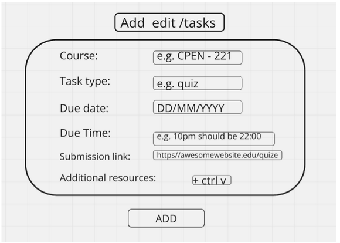

# Design/Solution

## Problem

Many students around the world suffer from a very heavy workload. With a heavy workload, the assignments can stack up fast. It could get so bad to the point where remembering when they are due could take more cognitive power than the actual assignment itself. This makes your time unproductive and inefficient, leading to spending countless hours sifting through different websites to figure out when your assignments are due.

## Solution

Clipboard envisions an application where you can track assignments very efficiently and streamline the process. All of your due dates for assignments, exams, and project deadlines will be in one application, on one page.

The app will be a desktop application. Users can start the app either from a terminal or using the GUI by running the appropriate executable on their platform. They can exit the application at any time by clicking the “x” button on the top right of the screen.

The page will display all of your assignments that are stored locally.
When you first open the page, you will see a row of cells labeled: **ID**, **Course**, **Type**, **Due Date**, **Due Time**, **Submission Link**, and **Resources**.

The user will be able to add an assignment by clicking the **Add** button on the page. Upon clicking the **Add** button, a screen will pop up, as shown below.

The **Add Task** screen will show the following fields: **Course Name**, **Task Type**, **Due Date**, **Due Time**, **Submission Link**, and **Resources**. For each of these fields, an example is shown before user input. The inputs for **Course Name**, **Task Type**, and **Submission Link** will not be validated. Anything typed in the input bar when the addition is confirmed will be used as the value of the field.

The field **Submission Link** does not enforce an actual link, as some tasks, such as in-person examinations and quizzes, do not have links. Users can choose to enter the location of the room where the exam is held by entering a regular string.

For the fields **Due Date** and **Due Time**, the program will check for valid input in the correct format. For example, if the date is October 23rd, 2024, at 10 PM, the due date input should be in `DD/MM/YYYY` format (`23/10/2024`), and the due time input should be in `HH:MM` format using the 24-hour clock (`22:00`).

The field **Resources** expects links to web pages separated by spaces

If a field contains invalid inputs when the **Add** button is pressed, the contents of the invalid fields will turn red, and a message will display at the bottom of the add box prompting the user to fix the invalid inputs. Once all inputs are valid, the entry will be added to the database and displayed in the list of tasks.

### Rules for adding and editing tasks

- **Valid case** -> Add button works and task is added/edited.
    - course: `CPEN_221`
    - Task type: `quiz`
    - Due date: `24/10/2024`
    - Due time: `11:00`
    - Submission link: `https://awesomewebsite.edu/quiz`
    - Resources: `https://awesomewebsite.edu/practice1 https://awesomewebsite.edu/practice2 https://awesomewebsite.edu/practice3`

- **Valid case, submission link not a link** -> Add button works and task is added/edited.
    - course: `CPEN_221`
    - Task type: `quiz`
    - Due date: `24/10/2024`
    - Due time: `11:00`
    - Submission link: `ICCS 014`
    - Resources: `https://awesomewebsite.edu/practice1 https://awesomewebsite.edu/practice2 https://awesomewebsite.edu/practice3`

- **Wrong due date format** -> Add button makes due date red and an error message is displayed at the bottom, task will not be added
    - course: `CPEN_221`
    - Task type: `quiz`
    - Due date: `October 24th, 2024`
    - Due time: `11:00`
    - Submission link: `https://awesomewebsite.edu/quiz`
    - Resources: `https://awesomewebsite.edu/practice1 https://awesomewebsite.edu/practice2 https://awesomewebsite.edu/practice3`

- **Wrong due time format** -> Add button makes due date red and an error message is displayed at the bottom, task will not be added
    - course: `CPEN_221`
    - Task type: `quiz`
    - Due date: `24/10/2024`
    - Due time: `11PM`
    - Submission link: `https://awesomewebsite.edu/quiz`
    - Resources: `https://awesomewebsite.edu/practice1 https://awesomewebsite.edu/practice2 https://awesomewebsite.edu/practice3`

- **Invalid resources** -> Add button makes due date red and an error message is displayed at the bottom, task will not be added
    - course: `CPEN_221`
    - Task type: `quiz`
    - Due date: `24/10/2024`
    - Due time: `11:00`
    - Submission link: `https://awesomewebsite.edu/quiz`
    - Resources: `awesomesite_practice_1 awesomesite_practice_2`

### ID of tasks
Every task added to the database will be assigned a unique ID, represented by a positive integer. The first task added after the program runs for the first time will have the ID `1`. Subsequent tasks will receive IDs in increasing order. If tasks are removed between additions, the IDs of new tasks will continue from the largest ID currently in the database, without filling in gaps.

For example, if 10 tasks were added and tasks 3, 6, and 10 were removed, and then 3 more tasks were added, the IDs of the new tasks would be 11, 12, and 13.

### Handling of duplicates

The program does **NOT** check for duplicate tasks. If a user enter two tasks with the exact same fields, they will have different IDs and handled as different tasks. As such, in all cases that one of them is displayed, the other
one will also be displayed.

---

## The Main View

The main view of the app is a table where each row represents a task added by the user.

__Only tasks whose due dates and times have not passed yet at the time the app is run will be displayed by default.__

__Users may apply a filter to display overdue tasks.__

### Below is the view with one task added:

On the top left, there will be an input bar for filters. Users can type in various tags separated by a single space and then click the **Search** button to update the view according to the filters.

### Filters:
- **type:** shows only tasks of this type.
- **course:** shows only tasks from this course.
- **order:** indicates the order of tasks shown (by default, the view is in ascending order of due dates). Available orderings are:
    - `due_date`: tasks are shown in increasing order of due dates and times.
    - `due_date_descending`: tasks are shown in decreasing order of due dates and times.
    - `id`: tasks are shown in increasing order of addition to the database.
    - `id_descending`: tasks are shown in decreasing order of addition to the database.

- **this_week:** A week is defined as 00:00 on Monday to 23:59 on Sunday. This flag shows only tasks due in the current week,
  the user needs to specify the `show_overdue` flag for tasks due on dates prior to the current day in the week .
  For example, if the current date and time is Wednesday, October 23rd, 2024, at 10 PM, this tag will display tasks due between Wednesday, October 23rd, 2024, 22:00 and Sunday, October 27th, 2024, 23:59.

- **next_week:** Similar to **this_week**, but filters tasks due in the upcoming week.

- **from:** Specifies the earliest due date of tasks to include in the filtered view. Format: `from:DD/MM/YYYY`.
  This flag will include tasks from the start of the date specified (from 00:00). This tag only sets a lower bound for the due date range.
  For example, `from:23/10/2024` will show tasks due on or after 00:00, October 23rd, 2024 that are not overdue at the time the program runs.

- **to:** Specifies the latest due date of tasks to include in the filtered view. Format: `to:DD/MM/YYYY`.
  This flag will include tasks until the end of the date specified (until 23:59). This tag only sets an upper bound for the due date range.
  For example, `to:23/10/2024` will show tasks due on or before 23:59, October 23rd, 2024 that are not overdue at the time the program runs.

- **show_overdue**: Enables tasks whose due dates and times have passed at the time the app is running to show on the view

### Rules for Filters:
- Only one of the filters **this_week**, **next_week**, or the combination of **from:** and **to:** will take effect.
    - Example: `next_week this_week from:23/10/2024 to:01/12/2024` will only filter tasks for the upcoming week.
    - Example: `from:23/10/2024 this_week to:01/12/2024` will filter tasks from October 23rd, 2024 to December 1st, 2024.
    - Example: `from:23/10/2024 this_week` will filter tasks from October 23rd, 2024 onward.

- Invalid tags will be ignored.
    - Example: `cuorse:MATH100 tpye:quiz next_week` will show all tasks in the coming week.
    - Example: `course:MTAH100 type:quizx next_week` will show no tasks, unless the user made the same typos when adding the tasks.
    - Example: `from:October23rd2024 to:01/12/2024` will show all tasks up to December 1st, 2024 (the invalid "from:" tag is ignored).

- Only the first valid **order:** tag will take effect.
    - Example: `order:hamburger order:id` sorts tasks by ascending ID.
    - Example: `order:id order:id_descending` sorts tasks by ascending ID.

- Multiple **course:** and **type:** tags are allowed to filter by multiple categories.
    - Example: `course:MATH100 course:APSC160` will show tasks for both MATH100 and APSC160.
    - Example: `course:MATH100 type:quiz type:midterm` will show quizzes and midterms for MATH100.

- The flags `this_week`, `from:` and `to:` do **NOT** show overdue tasks by default, the user have to specify the `show_overdue`tag if they wish to view overdue tasks.
    - Example: `this_week`: only shows tasks not overdue yet in the same week as the time the app is ran
    - `this_week show_overdue`: shows all tasks, including overdue ones in the same week as the time the app is ran
    - `from:20/10/2024 to:25/10/2024` and the app is ran on October 23rd, 2024 at 10PM: only tasks not due from October 23rd, 2024, 22:00 to October 25th, 2024 at 11:59 PM will be

---
### Export to Calendar format
There is a button on the top right of the view to export the database to a `.ics` file, compatible with most calendar applications. This button will save a `.ics` file to the user’s machine.

### Edit and Delete tasks

On hover over each task’s row, two buttons will appear on the side for the **Edit** and **Delete** functions.

### Edit Screen:

The **Edit** screen has the same input fields as the **Add Task** screen. However, the input bars will display the current assignment information instead of example inputs, allowing you to modify anything. To complete the edits, click the **Add** button to confirm your changes. If you no longer want to change the assignment or dislike the changes, press `Esc` on your keyboard to close the popup without saving.

### Delete Screen:

The **Delete** screen is a pop-up that will display the message:

> "Are you sure you want to delete this?"

Below the message, there will be two buttons: **Yes** and **No**.

- If you press **Yes**, the assignment you selected will be removed from the display, and the prompt will disappear.
- If you press **No**, the prompt will disappear, and nothing in the display will change.

